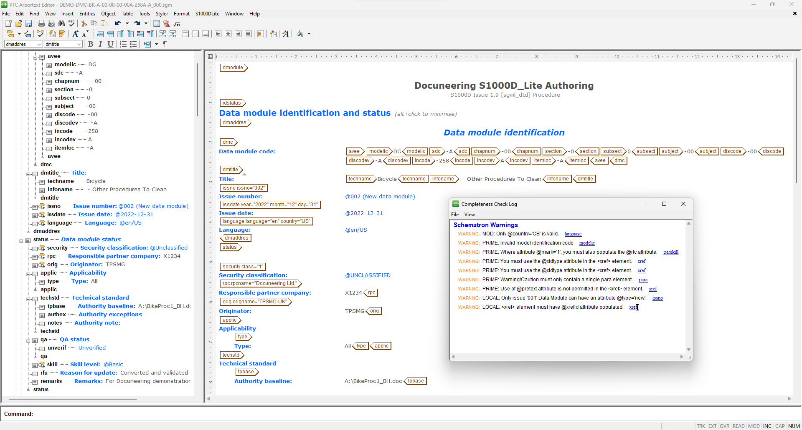
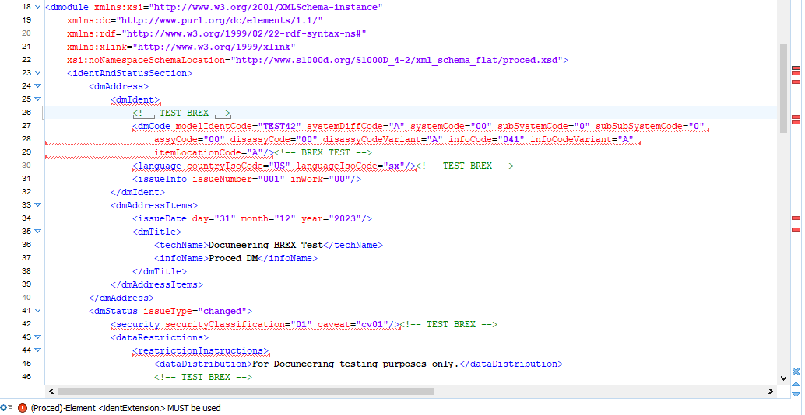

# S1000D BREX to Schematron

The 'S1000D-BREX-to-Schematron.xsl' file will convert a standard S1000D BREX into a Schematron file.

The resultant Schematron file can then be used to validate you S1000D Data Modules source data in any number of different XML editors.

## Arbortext Editor

Once configured, click the 'Check Completeness' icon to validate you Data Module

## Oxygen XML

You need to configure a validation scenario within your framework. Once setup, Oxygen XML Editor implements a 'live' or 'on-the-fly' validation process:

---
## Convertion Process

### Command line

java -jar "saxon-he-10.9.jar" -xsl:"S1000D-BREX-to-Schematron.xsl" -s:"TEST42-BREX.XML" -o:"TEST42-BREX.SCH"

